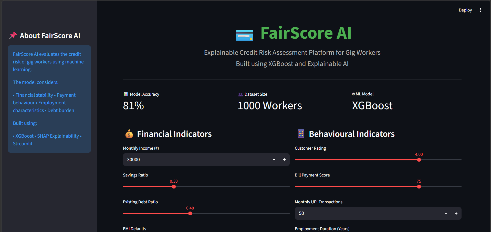
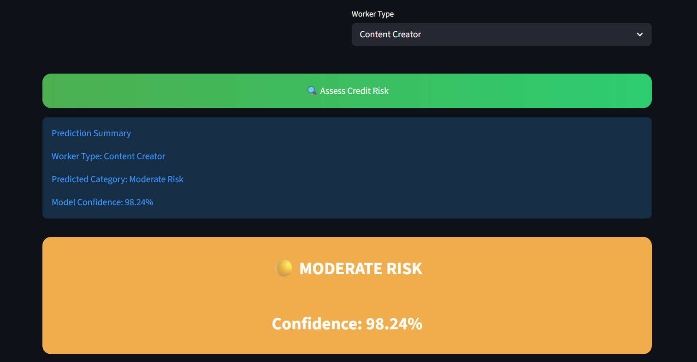
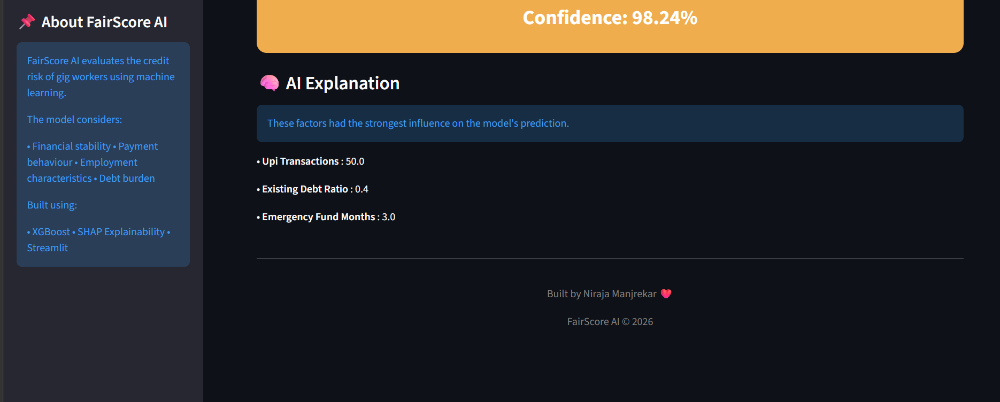

## 🚀 Live Demo

Try FairScore AI here:

https://nira976-fairscore-ai-appstreamlit-app-5oe0e3.streamlit.app/


# 💳 FairScore AI

An Explainable Credit Risk Assessment Platform for Gig Economy Workers using Machine Learning and Explainable AI.

---

## 📌 Problem Statement

Traditional credit scoring systems often fail to assess gig workers fairly due to irregular income patterns and limited credit history.

FairScore AI addresses this challenge by leveraging machine learning techniques to predict credit risk using alternative financial and behavioral indicators relevant to gig economy workers.

---

## 🚀 Features

- Predicts credit risk categories:
  - 🟢 Low Risk
  - 🟡 Moderate Risk
  - 🔴 High Risk

- Interactive Streamlit dashboard

- Explainable AI using SHAP

- Confidence score for each prediction

- Premium user interface with real-time assessment

---

## 🛠️ Tech Stack

- Python
- Pandas
- NumPy
- Scikit-learn
- XGBoost
- SHAP
- Streamlit
- Git & GitHub

---

## 📂 Project Structure

```
FairScore-AI/
│
├── app/
│   └── streamlit_app.py
│
├── data/
│
├── models/
│   └── fairscore_xgb_model.pkl
│
├── notebooks/
│   ├── dataset_creation.ipynb
│   ├── eda.ipynb
│   ├── 03_model_training.ipynb
│   └── 04_shap_explainability.ipynb
│
├── screenshots/
│
├── requirements.txt
├── README.md
└── .gitignore
```

---

## 📊 Model Performance

| Metric | Value |
|---------|--------|
| Accuracy | 81% |
| Model | XGBoost |
| Classes | High Risk, Moderate Risk, Low Risk |

---

## 🧠 Explainability

The project incorporates SHAP (SHapley Additive exPlanations) to provide transparency into model predictions.

Top influencing factors include:

- EMI Defaults
- Existing Debt Ratio
- Emergency Fund Months
- Bill Payment Score
- Savings Ratio

This allows users to understand why a specific risk category was assigned.

---

## 📸 Application Screenshots

### Dashboard



### Risk Assessment



### SHAP Explanation



---

## ⚙️ Installation

Clone the repository:

```bash
git clone https://github.com/nira976/FairScore-AI.git
```

Navigate to the project directory:

```bash
cd FairScore-AI
```

Install dependencies:

```bash
pip install -r requirements.txt
```

Run the Streamlit application:

```bash
streamlit run app/streamlit_app.py
```

---

## 🎯 Future Enhancements

- Cloud deployment using Streamlit Community Cloud
- Integration with external financial APIs
- PDF report generation
- Fairness analysis across worker categories
- Enhanced visual analytics dashboard

---

## 👩‍💻 Author

**Niraja Manjrekar**

GitHub: https://github.com/nira976

---

## ⭐ Support

If you found this project interesting, consider giving it a star on GitHub!